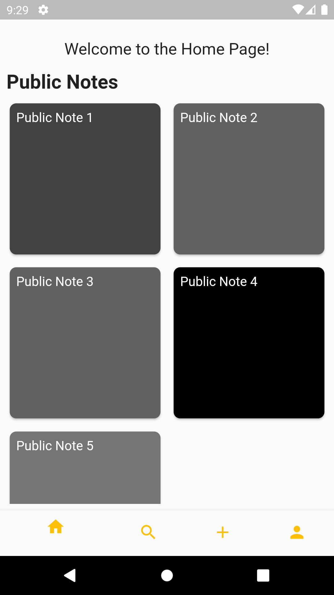
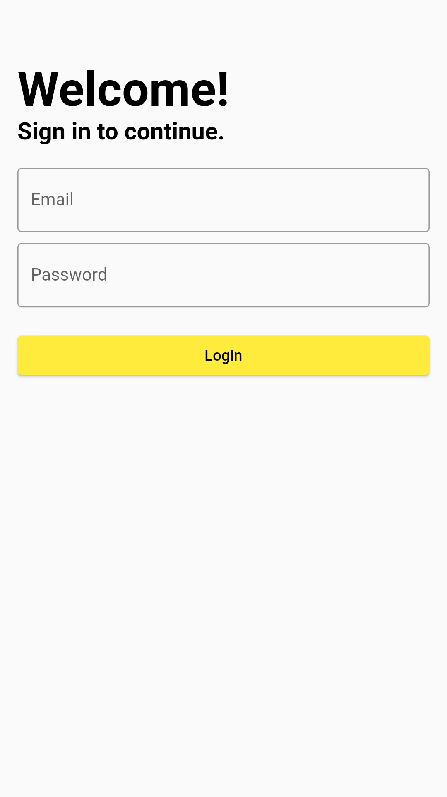
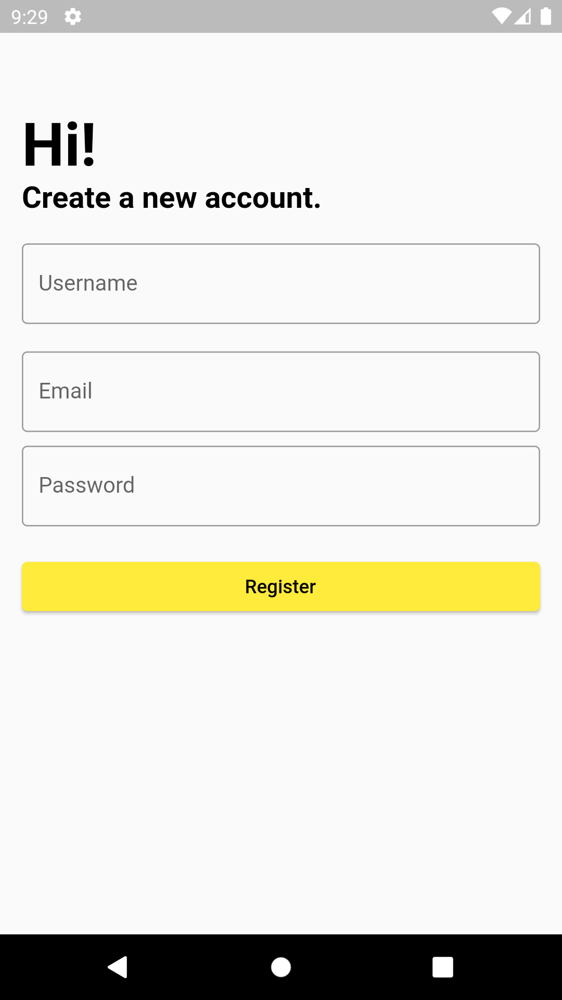
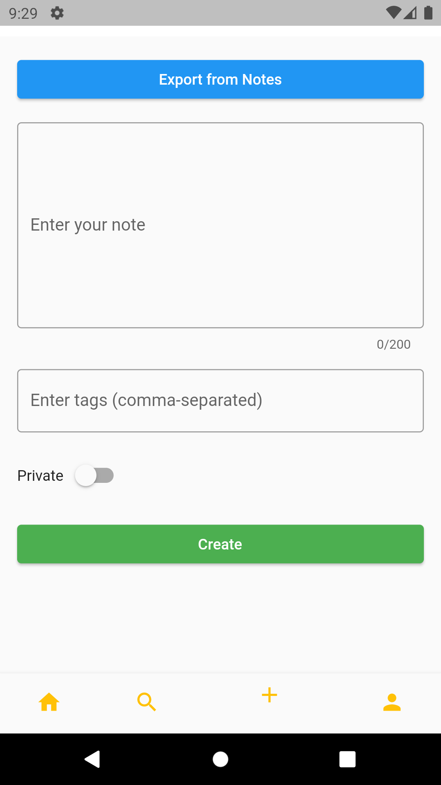
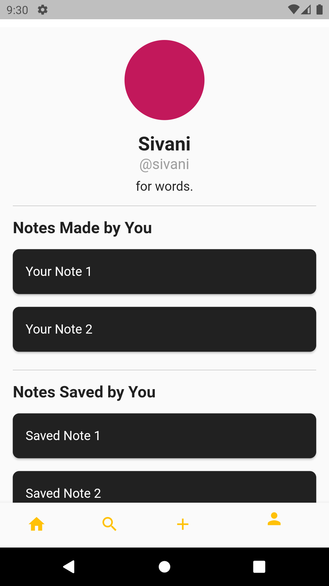

# Notific App 

A Flutter app for effortlessly creating, organizing, and sharing your small notes, thoughts, poems, and more.

## Features

- **Create Notes:** Write and save your thoughts, poems, or any text-based notes. The app provides a simple and intuitive interface for quick note-taking.

- **Search Notes:** Easily find notes using tags or keywords. Efficient search functionality helps you locate specific notes based on content or associated tags.

- **Profile Page:** Customize your profile with a bio, profile picture, and access to your created and saved notes. Showcase your unique identity within the app.

- **Public Notes Feed:** Explore a dynamic feed of notes shared by other users. Discover a diverse range of content and gain inspiration from the broader community.

 ## App 

 ### Welcome Page
  

   ### Login Page

  

   ### Register Page 

  
  

 ### Home Page

  

  ### Search Page

  

   ### Create Page

  

   ### Profile Page

  

  ## Motivation

In a world full of ideas, Notific App aims to provide a platform for individuals to express themselves through the art of note-taking. Whether it's a fleeting thought or a carefully crafted poem, this app encourages users to capture and share their moments of inspiration.

## Technologies Used

- **Flutter:** The UI toolkit for building natively compiled applications for mobile, web, and desktop from a single codebase.

- **Firebase:** Powering the backend with Firebase for real-time data synchronization, user authentication, and cloud storage.

